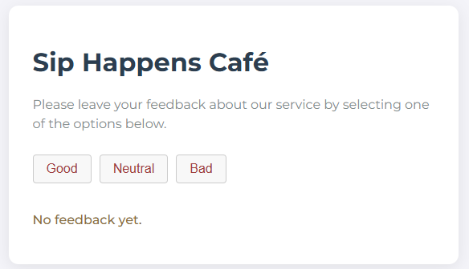
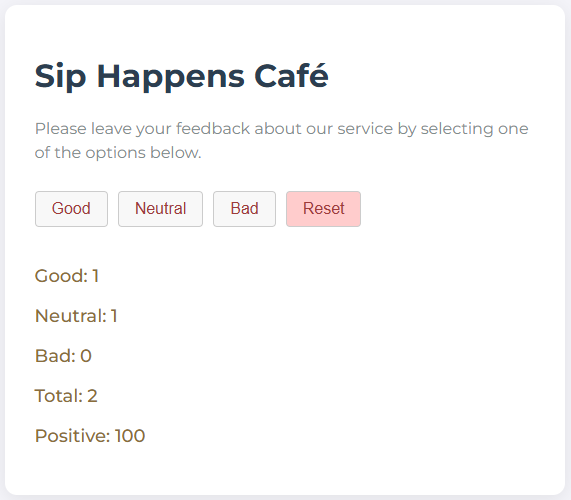
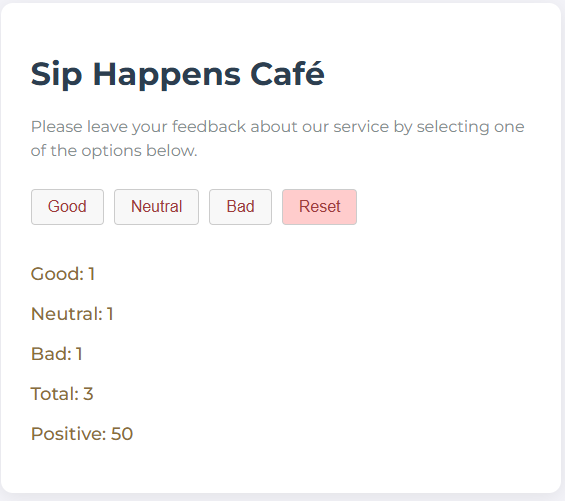

# Sip Happens Café - Feedback App

A simple, interactive feedback management application built with **React** and **Vite**. This project allows users to collect, view, and persist customer feedback categories (Good, Neutral, Bad) while calculating real-time statistics.

---

## 🚀 Features

- **Real-time Feedback Tracking:** Instantly update feedback counts for different categories.

- **Dynamic Statistics:** Automatically calculates the total number of feedbacks and the percentage of positive reviews.

- **Conditional Rendering:** The feedback statistics and Reset button are only visible once at least one feedback is collected.

  - A notification message appears when no feedback has been provided yet.

- **Data Persistence:** Uses LocalStorage to save feedback data, ensuring statistics remain even after a page refresh.

- **Modular Styling:** Styled using **CSS Modules** to ensure scoped and maintainable styles.

- **Responsive Design:** Fully centered and responsive layout for a better user experience.

---

## 🛠️ Technologies Used

- **React** (Functional Components, Hooks: `useState`, `useEffect`) ⚛️

- **Vite** (Build tool) ⚡

- **CSS Modules** - (Scoped styling) 🎨

- **JavaScript** (ES6+) 💻

---

## 📦 Project Structure

The project follows a modular directory structure for scalability:

```
├── index.html          # Main entry point and Google Fonts integration
├── src/
│   ├── components/     # Modular component structure
│   │   ├── Description/     # Application title and instructions
│   │   ├── Options/         # Feedback interaction buttons
│   │   ├── Feedback/        # Data visualization and statistics
│   │   └── Notification/    # Empty state messaging
│   ├── App.jsx         # Logic, state management & LocalStorage sync
│   ├── App.module.css  # Layout and main container styles
│   ├── index.css       # Global styles (typography & resets)
│   └── main.jsx        # React DOM rendering
└── package.json        # Project dependencies
```

---

## 🌟 Key Features

1. **Interactive Feedback System** ☕ A centralized system to collect customer reviews across three categories:

   - **Good, Neutral, and Bad** feedback buttons.

   - **Dynamic Updates:** Uses computed property names to update state types efficiently.

2. **Real-time Statistics** 📊 An automated calculation dashboard that provides:

   - **Total Count:** Sum of all collected feedback.

   - **Positive Percentage:** Calculates the ratio of positive reviews, excluding "Neutral" votes for accurate satisfaction tracking.

3. **Persistent Memory** 💾 Integrated with Browser LocalStorage:

   - **Auto-save:** Automatically saves counts whenever a button is clicked.

   - **Auto-load:** Retrieves saved data on page refresh, ensuring user data is never lost.

4. **Dynamic UI Logic** 🔄

   - **Smart Display:** Statistics and the Reset button only appear after the first feedback is given.

   - **Empty State:** Shows a friendly "No feedback yet" message when the dashboard is empty.

---

---

## 📸 App Preview

|              Default State              |            Good             |
| :-------------------------------------: | :-------------------------: | --------------------------------- | ------------------------- |
|  |  |  |  |

|              Neutral              |            Bad            |
| :-------------------------------: | :-----------------------: |
|  |  |

---

## 🚀 How to Run

1. Clone the repository.

2. Install dependencies: `npm install`

3. Start the development server: `npm run dev`

---

## Author

**Halenur Gürel** _Homework Project - React State, Effects & Persistence 🚀_

🔗 [GitHub Profile](https://github.com/halenurgurel)

🎯 _"This project focuses on mastering React state lifting, synchronization with web APIs (LocalStorage), and conditional UI rendering to build robust and user-friendly web applications."_
